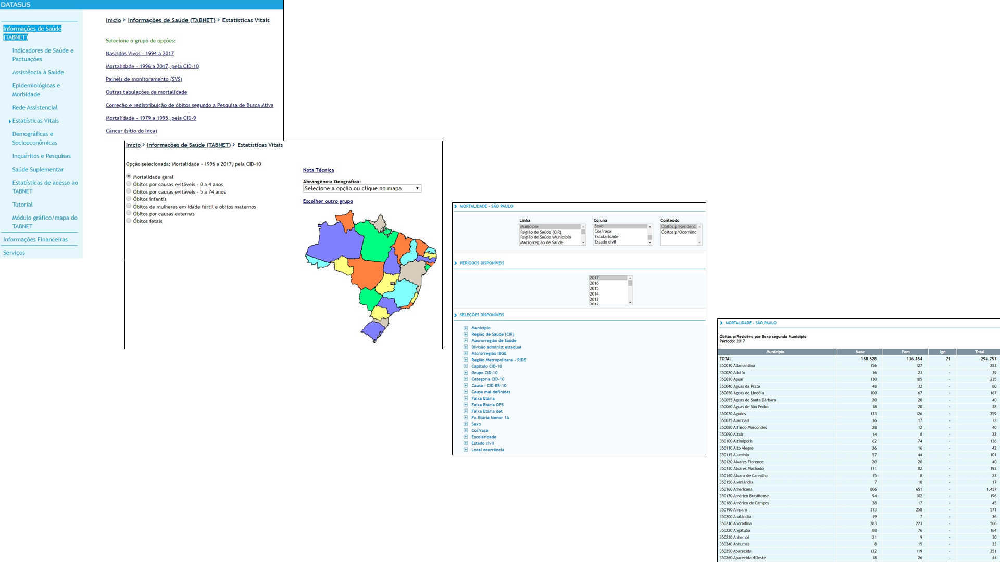
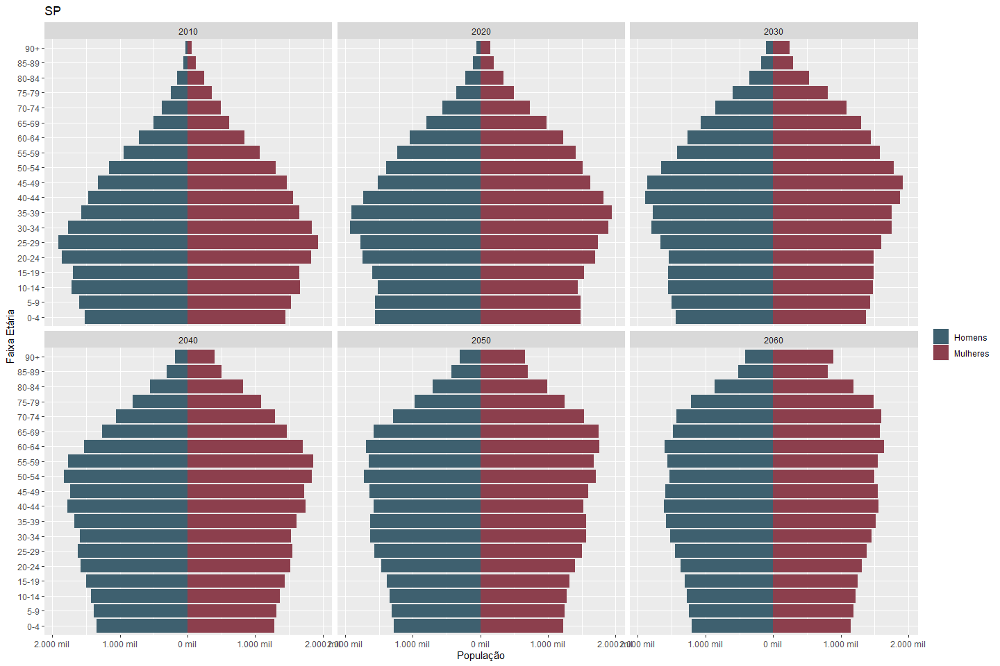
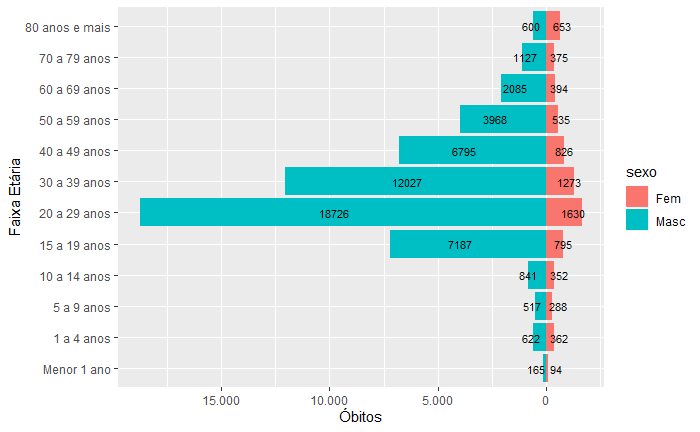
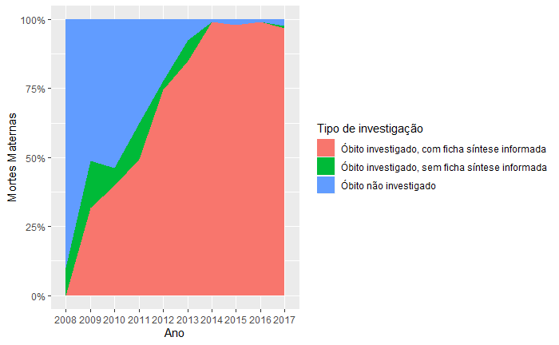
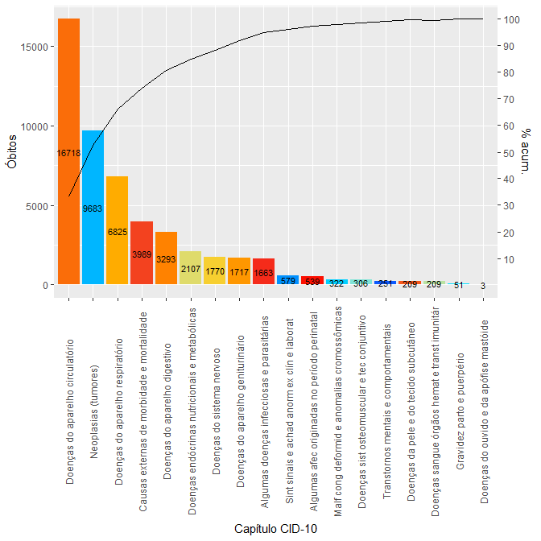
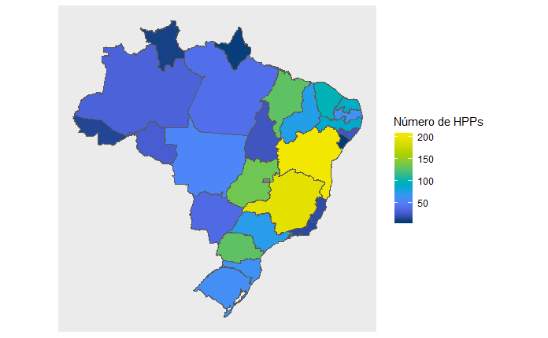

```{r setup, include=FALSE}
knitr::opts_chunk$set(echo = FALSE)
library(here)
```

## 1 Datasus

{width=100%}


<div class="notes">

Informações sobre:

- nascimentos;
- mortes;
- internações hospitalares;
- consultas;
- estabelecimentos e profissionais de saúde;

</div>


## 2 Pacotes

- [read.dbc](https://github.com/danicat/read.dbc): importação dos microdados
- [datasus](https://github.com/rpradosiqueira/datasus): scraping da página do Tabnet
- [brmap](https://github.com/italocegatta/brmap): mapas Brasil

<br>

- [microdatasus](https://github.com/rfsaldanha/microdatasus): download dos microdados


# 3 Aplicações

## Pirâmide Etária

{width=100%}


## Óbitos por causas externas, Pará, 2008-2017

{width=100%}


## Mortalidade Materna

{width=100%}


## Causas de óbitos, Santo André, 2017

{width=70%}


## Hospitais de Pequeno Porte

{width=100%}


## 4 Reprodutibilidade

- RMarkdown
- Parametrização
- Gerenciamento de pacotes
- Virtualização de containers com o Docker


# Obrigado!

leonardoshibata.github.io/satRday-2019
